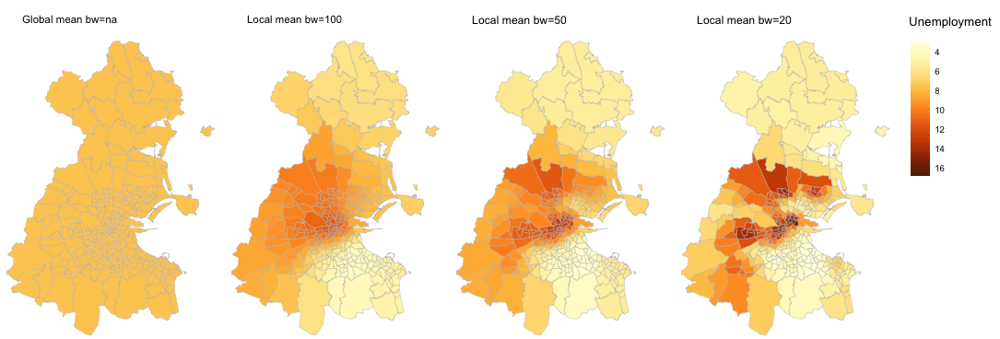

# Week 07: Exploring Geographically-Weighted Summary Statistics

## Introduction

This week's lecture introduced the concept of *geographically-weighted statistics* (GW).  GW-statistics were proposed in recognition of the fact that phenomena often vary systematically from place to place. They allow us to identify *changes* in the process that we're studying, for example crime rates or house prices, over space. 

GW-statistics do so by considering a subset of spatial data local to the spatial area at which observations are collected and calculating multiple *local* statistics. A moving spatial window is used to identify local neighbours and a weighting scheme is applied to these neighbouring observations according to a distance-decay function. This has a smoothing effect, making the spatial variation seem continuous. The size of the spatial window is referred to as a bandwidth. Small bandwidths lead to more rapid spatial variation in the results while large bandwidths tend increasingly towards the global summary statistic. 

In this practical we'll produce and inspect GW-summary statistics in [R](https://www.r-project.org), using the [RStudio](https://www.rstudio.com) IDE. We will do so using the [GWmodel](https://cran.r-project.org/web/packages/GWmodel/GWmodel.pdf) package and with examples published in the accompanying paper by [Gollini *et al.* 2015](https://www.jstatsoft.org/article/view/v063i17). 


## Configure R 

```{r, echo=TRUE, eval=FALSE}
setwd("./week_07")
# Install necessary packages if you don't already have them.
install.packages("GWmodel")
install.packages("tmap")
install.packages("dplyr")
# Make packages available in your current session.
library(GWmodel)
library(tmap)
library(dplyr)
```

## Datasets 

Next week we'll explore GW-Regression using a very new dataset. However, for the time being, we'll use a dataset provided by the *GWmodel* package -- the DubVoter data. This consists of 322 electoral divisions in Greater Dublin and for each division describes *% voter turnout by electoral division* in the Irish 2004 elections (`GenEl2004`), as well as statistics on:

* `DiffAdd`: *% One year migrants (moved to a different address one year ago)*
* `LARent`: *% Local Authority renters*
* `SC1`: *% Social class one (high social class)*
* `Unempl`: *% Unemployed*
* `LowEduc`: *% Without formal education*
* `Age18_24`: *% Age group 18-24*
* `Age25_44`: *% Age 25-44*
* `Age45_64`: *% Age 45-64*

```{r, echo=TRUE, eval=FALSE}
# Store the data in your session
data("DubVoter") 
```

This command loads a SpatialPolygonsDataFrame, called `Dub.voter`  -- you can inspect this under the `Values` pane in RStudio. If you've used a GIS before, a SpatialPolygonsDataFrame is very similar to a [shapefile](https://en.wikipedia.org/wiki/Shapefile). It contains geometries for the 322 electoral divisions in Greater Dublin and for each stores the above summary statistics. These statistics can be accessed as a DataFrame via `Dub.voter@data`.

## Exploring GW-means

A range of GW-summary statistics can be generated with the `gwss()` function. By typing `?gwss` into your R console you can read more about this function. 

In the code below we provide a reference to our data (`Dub.voter`), the variables over which we'd like to calculate GW-summary statistics (`vars=`), the  procedure for the distance weighting (`kernel=`), whether we would like to use a distance-defined bandwidth or one that ensures an equal number of observations for each local statistic that is calculated (`adaptive=`) and a size for this bandwidth (`bw=`). We use an adaptive bandwidth -- that is, each bandwidth contains an equal number of electoral divisions and therefore may vary in geographic size, with smaller spatial bandwidths in central Dublin where the density of electoral divisions is greater.

The function returns a `gwss` object, which contains a SpatialPolygonsDataFrame. In the code below we create several `gwss` objects of varying bandwidths. We also create a function for conveniently specifying Choropleth maps for visually inspecting the gw-output.

```{r, echo=TRUE, eval=FALSE}
# Calculate GW-ss for global model and then with decreasing bandwidths
bandwidth <- 322
gw_ss_global <- gwss(Dub.voter, vars  =  c("GenEl2004", "LARent", "Unempl"),
                  kernel = "boxcar", adaptive = TRUE, bw = bandwidth, quantile = TRUE)
bandwidth <- 100
gw_ss_bs_100 <- gwss(Dub.voter, vars  =  c("GenEl2004", "LARent", "Unempl"),
                  kernel = "bisquare", adaptive = TRUE, bw = bandwidth, quantile = TRUE)
bandwidth <- 50
gw_ss_bs_50 <- gwss(Dub.voter, vars  =  c("GenEl2004", "LARent", "Unempl"),
                  kernel = "bisquare", adaptive = TRUE, bw = bandwidth, quantile = TRUE)
bandwidth <- 20
gw_ss_bs_20 <- gwss(Dub.voter, vars  =  c("GenEl2004", "LARent", "Unempl"),
                  kernel = "bisquare", adaptive = TRUE, bw = bandwidth, quantile = TRUE)

# Merge non-weighted values and bandwidths for comparison into a single "gwss" object. 
gw_ss_bs <- gw_ss_bs_20
# Create column on which to merge
gw_ss_bs$SDF@data$row_index <- 1:nrow(gw_ss_bs$SDF@data)
# Define columns to merge.
col_ids <- c(1:6,19:21)
# Select and rename relevant columns for merging.
gw_ss_global$SDF@data <- gw_ss_global$SDF@data[,col_ids]
colnames(gw_ss_global$SDF@data) <- paste(colnames(gw_ss_global$SDF@data), "GM", sep = "_")
gw_ss_global$SDF@data$row_index <- 1:nrow(gw_ss_global$SDF@data)
# Merge to single "gwss" object.
gw_ss_bs$SDF@data <- merge(gw_ss_bs$SDF@data, gw_ss_global$SDF@data)
# Bandwidth = 100.
gw_ss_bs_100$SDF@data <- gw_ss_bs_100$SDF@data[,col_ids]
colnames(gw_ss_bs_100$SDF@data) <- paste(colnames(gw_ss_bs_100$SDF@data), "100", sep = "_")
gw_ss_bs_100$SDF@data$row_index <- 1:nrow(gw_ss_bs_100$SDF@data)
gw_ss_bs$SDF@data <- merge(gw_ss_bs$SDF@data, gw_ss_bs_100$SDF@data)
# Bandwidth = 50.
gw_ss_bs_50$SDF@data <- gw_ss_bs_50$SDF@data[,col_ids]
colnames(gw_ss_bs_50$SDF@data) <- paste(colnames(gw_ss_bs_50$SDF@data), "50", sep = "_")
gw_ss_bs_50$SDF@data$row_index <- 1:nrow(gw_ss_bs_50$SDF@data)
gw_ss_bs$SDF@data <- merge(gw_ss_bs$SDF@data, gw_ss_bs_50$SDF@data)
# Bandwidth = 20.
gw_ss_bs_20$SDF@data <- gw_ss_bs_20$SDF@data[,col_ids]
colnames(gw_ss_bs_20$SDF@data) <- paste(colnames(gw_ss_bs_20$SDF@data), "20", sep = "_")
gw_ss_bs_20$SDF@data$row_index <- 1:nrow(gw_ss_bs_20$SDF@data)å
gw_ss_bs$SDF@data <- merge(gw_ss_bs$SDF@data, gw_ss_bs_20$SDF@data)

# Set coordinate system.
proj4string(gw_ss_bs$SDF) <- CRS("+init=epsg:29902")

# Function allowing parameterised calls to the tmap (package that generates the Choropleths).
draw.gwmap <- function(data, title, fields, labels, style, palette, local_colour) {
  external_legend <- TRUE
  if(local_colour)
  {
      external_legend <- FALSE
  }
  tm_shape(data) +
  tm_fill(col=fields, title=title,
                style=style,palette=palette, size=0.2) + 
  tm_borders(col="#bdbdbd", lwd=0.5) +
  tm_facets(free.scales = local_colour) +
  tm_layout(title=labels,
     frame=FALSE,
     title.snap.to.legend=FALSE,
     title.size=1,
     title.position = c("left", "top"),
     inner.margins = c(0,0,0.15,0),
     legend.title.size=1,
     legend.text.size=0.6,
     legend.outside=external_legend)
}
```

Run the code below to inspect gw-means for our outcome variable (*% turnout in electoral division*) and the variables we assume to be correlates (*% LA renting*, *% unemployed*).

```{r, echo=TRUE, eval=FALSE}
# Map original values and gw-weighted means.
local_colour <- FALSE
data <- gw_ss_bs$SDF
palette <- "YlOrBr"
style <- "cont"
title <- "Turnout"
fields <- c("GenEl2004_LM_GM","GenEl2004_LM_100", "GenEl2004_LM_50", "GenEl2004_LM_20")
labels <- c("Global mean bw=na","Local mean bw=100", "Local mean bw=50", "Local mean bw=20")
draw.gwmap(data, title, fields, labels, style, palette, local_colour)

title <- "LA Renting"
fields <- c("LARent_LM_GM","LARent_LM_100", "LARent_LM_50", "LARent_LM_20")
draw.gwmap(data, title, fields, labels, style, palette, local_colour)

title <- "Unemployment"
fields <- c("Unempl_LM_GM","Unempl_LM_100", "Unempl_LM_50", "Unempl_LM_20")
draw.gwmap(data, title, fields, labels, style, palette, local_colour)

```


After running the final blocks of code your charts should look something like those below. Note that here we plot GW-mean values -- we'll explore a richer set of GW-summary statistics shortly.  





### Explore for yourself

* How would you describe the effect of the geographic weighting? 
* What problems are there associated with applying this weighting? 
* Does the geographic weighting capture *change* in demographic characteristics equally well for each variable? 


## Exploring local variability using GW-stats

An advantage of GW-summary statistics is that we can explore structure that would be difficult to discern from the raw data or a global statistic. For each local summary statistic we can, for example, calculate the GW-standard deviation in attribute values. 

The code below allows you to build Choropleth maps of GW-standard deviation for the *% turnout* variable.

```{r, echo=TRUE, eval=FALSE}
title <- "Variation in turnout"
fields <- c("GenEl2004_LSD_GM","GenEl2004_LSD_100", "GenEl2004_LSD_50", "GenEl2004_LSD_20")
labels <- c("Global sd bw=na","Local sd bw=100", "Local sd bw=50", "Local sd bw=20")
draw.gwmap(data, title, fields, labels, style, palette, local_colour)
```

The maps below help emphasise the fact that turnout appears to vary more between electoral divisions in areas of central and west Dublin.


### Explore for yourself

* Try exploring variation in the *LA rent* and *unempl* variables. You may wish to use a robust version of dispersion generated by the `gwss()` function (e.g. *GenEl2004_IQR*).
* Thinking about the GW-regression examples introduced in the lecture, what pattern of GW-mean and GW-variation might provide evidence for a locally varying regression model?
     
## Finding non-stationarity

Hopefully you have seen that we can use GW-summary statistics to help emphasis *change* and *variation* in attribute values over space and that exploratory analysis over multiple summary statistics and variables allows distinct local contexts to be identified. 

That these local contexts exist is an argument for attempting to account for spatial variation when *explaining* phenomena -- and therefore for approaches such as GW-regression. However, a crucial question is whether the *relationships* between variables differ at these local contexts. 

Run the code below to generate maps of GW-correlation coefficients between *turnout* and *LA rent*. The relationship appears to be non-stationary: a  stronger negative relationship is present in areas of central and south-west Dublin than elsewhere in Dublin.

```{r, echo=TRUE, eval=FALSE}
title <- "Correlation: turnout vs rent"
fields <- c("Corr_GenEl2004.LARent_GM","Corr_GenEl2004.LARent_100", "Corr_GenEl2004.LARent_50", "Corr_GenEl2004.LARent_20")
labels <- c("Global corr bw=na","Local corr bw=100", "Local corr bw=50", "Local corr bw=20")
palette <- "PRGn"
draw.gwmap(data, title, fields, labels, style, palette, local_colour)
```


### Explore for yourself

* Try exploring gw-correlation between the *LA rent* and *unempl* variables. 
* What do you observe and what might be the implications for a multivariate gw-regression model that tries to model *turnout* using *LA rent* and *unempl*? 

## Towards a GW-Regression model

Next week's extended practical will be quite an involved data analysis, developing a GW-regression model that attempts to identify local *explanations* behind a very recent and significant event for the UK. However, we'll quickly introduce the process of creating a gw-regression model using the `GWmodel` package. 

We wish to create a model that explains voter turnout in the 2004 Dublin elections (*turnout* -- our outcome) using the socio-economic variables listed in the `Dub.voter` DataFrame. 

First we'll standardise and recentre our socio-economic variables. 
```{r, echo=TRUE, eval=FALSE}
Dub.voter@data <- Dub.voter@data %>%
  mutate(
    GenEl2004_zscore = (GenEl2004-mean(GenEl2004))/sd(GenEl2004),
    DiffAdd_zscore = (DiffAdd-mean(DiffAdd))/sd(DiffAdd),
    LARent_zscore = (LARent-mean(LARent))/sd(LARent),
    SC1_zscore = (SC1-mean(SC1))/sd(SC1),
    Unempl_zscore = (Unempl-mean(Unempl))/sd(Unempl),
    LowEduc_zscore = (LowEduc-mean(LowEduc))/sd(LowEduc),
    Age18_24_zscore = (Age18_24-mean(Age18_24))/sd(Age18_24),
    Age25_44_zscore = (Age25_44-mean(Age25_44))/sd(Age25_44),
    Age45_64_zscore = (Age45_64-mean(Age45_64))/sd(Age45_64)
    )
```


We've learnt a little about how gw-statistics vary with different bandwidths.  In gw-regression it is possible to derive an *optimum* bandwidth algorithmically with the `bw.gwr()` function. This works by creating an ensemble of GW-regression models at different bandwidths and identifying the bandwidth that results in the best model fit. Note that in the `bw.gwr()` function we provide the formula for our gw-regression model in the same way we would a multivariate linear regression model (using `lm()`).

```{r, echo=TRUE, eval=FALSE}
bandwidth <- bw.gwr(GenEl2004_zscore ~ DiffAdd_zscore + LARent_zscore + SC1_zscore + Unempl_zscore + LowEduc_zscore + Age18_24_zscore + Age25_44_zscore + Age45_64_zscore, data = Dub.voter, approach = "AICc", kernel = "bisquare", adaptive = TRUE)
```

We then use this bandwidth variable as a parameter when creating our gw-regression model, using the `bwr.basic()` function:

```{r, echo=TRUE, eval=FALSE}
gw_model <- gwr.basic(GenEl2004_zscore ~ DiffAdd_zscore + LARent_zscore + SC1_zscore + Unempl_zscore + LowEduc_zscore + Age18_24_zscore + Age25_44_zscore + Age45_64_zscore, data = Dub.voter, bw = bandwidth,  kernel = "bisquare", adaptive = TRUE, F123.test = TRUE)
# Set coordinate system.
proj4string(gw_model$SDF) <- CRS("+init=epsg:29902") 
```

The `bwr.basic()` function returns a `gwrm` object. Next week, we'll spend some time interpreting the output. If you're familiar with reading regression output, type `summary(gw_model)` into an R console for a summary of the regression coefficients and model fits.

For now, we'll produce one final set of maps investigating gw-regression coefficients for each of the explanatory variables used in the gw-model.

```{r, echo=TRUE, eval=FALSE}
local_colour <- FALSE
data <- gw_model$SDF
title <- "GW Coefficients"
fields <- colnames(gw_model$SDF@data[2:9])
labels <- colnames(gw_model$SDF@data[2:9])
palette <- "PRGn"
draw.gwmap(data, title, fields, labels, style, palette, local_colour)
```


### Explore for yourself
Inspecting the maps of regression coefficients, can you reason about:

* The suitability of gw-regression (and local models) for explaining voter turnout?
* The explanatory power of individual variables?

## Further Reading

* Brunsdon, C., Fotheringham, A.S. and Charlton, M. (2002). **[Geographically Weighted Summary Statistics](http://www.sciencedirect.com/science/article/pii/S0198971501000096)**. *Computers, Environment and Urban Systems*, 26(6): 501–24.

* Dykes, J. & Brunsdon, C. (2007). **[Geographically weighted visualization: Interactive graphics for scale-varying exploratory analysis](http://openaccess.city.ac.uk/3227/)**. *IEEE Transactions on Visualization and Computer Graphics*, 13(6):1161-1168.

* Gollini, I., Lu, B., Charlton, M., Brunsdon, C. and Harris, P. (2015), **[GWmodel: An R Package for Exploring Spatial Heterogeneity Using Geographically Weighted Models](https://www.jstatsoft.org/article/view/v063i17)**. *Journal of Statistical Software*, 63(17):1-50.
