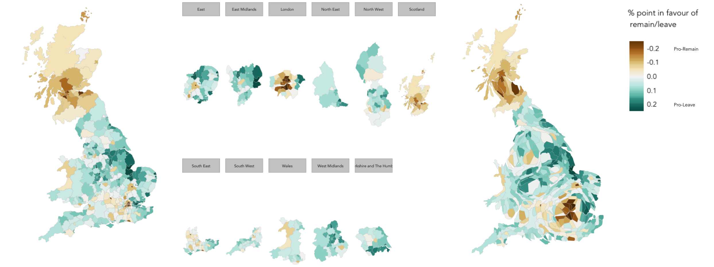

# Spatially varying explanations behind the Brexit vote

In this extended practical session you'll perform a reasonably involved data analysis in R. For those with existing knowledge of R or with an appetite for using R in the future, the more technical aspects will be of interest: the practical draws on some routine R packages and scripting conventions for structuring and charting data. For those who are certain that R is not a software environment they're likely to use,  aspects of the session that expose the data analysis process, the reasoning and interpretation of graphical output given research questions, will be of interest. The practical will cover a somewhat depressing, though very current, topic: the UK's referendum vote on membership of the EU. 

## Introduction

The narrow vote in favour of Leave was a shock to many. You've probably heard commentators remark on the underlying causes for why people voted as they did. These pronouncements have often been made based on the very obvious [geographic differences](http://www.bbc.co.uk/news/uk-politics-36616028) in voting preference.  A familiar caricature in the media is of Leave voting being a symptom of blue collar disaffection and Remain voting of liberal values and (relative) affluence. But is this borne out in the data? Here we'll take a single outcome variable -- the share of vote in favour of Leave in each GB Local Authority (LA) -- and study the extent to which key sociology-economic variables from the 2011 Census might *explain* this outcome. Using geographically-weighted stats we'll investigate how the relationships in candidate explanations vary geographically.

ADDITIONAL NOTE: We tried to keep this introduction brief. In your data analysis reports, and the write-up following this analysis, it will be necessary to provide a more up-front and specific set of research questions and motivation. Also note that we're not looking at individual behaviour here. We're looking at data aggregated at Local Authority (LA) level and can only attempt *explain* differences in voting prefence at this level. 

## How this applies to your coursework

This practical is mainly about how to use and implement methods in R. Don't forget that your coursework will need motivation, research questions and perhaps recommended actions that result from your findings.

For this practical, one *motivation* is that although the overall Remain:Leave vote was about 48:52, this ratio was certainty not uniformly spread. Every LA in Scotland voted to Remain, for example, and so too did inner London and parts of Northern Ireland. Motivating this study is better *understanding* as to what might drive these differences.

We could come up with *research questions* such as:

 * Did Scotland vote differently from the rest of the UK given its population structure? (Is Scotland different?)
 * Are the factors that drove the vote the same everywhere in the Great Britain?

This practical is about the *analytic tasks* chosen to answer such questions and the *visual analytics methods* that can be employed to carry out these tasks. A particular set of approaches is used here, but you should consider others that you've been exposed to in this module, plus those discovered during your group work literature reviews earlier this term.


## A few R basics

* Once you've opened this R Markdown file into RStudio, you can execute individual R commands by moving the text cursor to the line you wish to run and click "run (current line or selection)" button. I suggest you use the keyboard shortcut (Command-Return on the Mac).

* You need to instruct R as to the directory from which you will load data and export output. This can be done with the `setwd()` function. For a definition, type `?setwd` into your Console. Note that you can check your current working directory with `getwd()`.

*  The practical draws on several powerful contributed libraries for structuring data and charting. The "dplyr" library in particular offers numerous functions for working with [R Data Frames](https://stat.ethz.ch/R-manual/R-devel/library/base/html/data.frame.html). You will also notice the `%>%` piping operator, provided through the [magrittr](https://cran.r-project.org/web/packages/magrittr/) package; this allows better structuring and nesting of calls to "dplyr ". Charts are created using [ggplot2](http://docs.ggplot2.org/current/) and maps using [tmap](https://cran.r-project.org/web/packages/tmap/index.html). There are similarities in the syntax used by these two packages. The general approach is of treating graphical elements separately and building the features in a series of layers.

## Configure R and load data

You'll need access to the libraries below. Try each line one-by-one and if the package is not installed, install it using the following. Don't forget the quotes!

```{r, echo=TRUE, eval=FALSE}
install.packages("rgdal")
```

Once you've installed these libraries you need to make them available in your analysis environment through `library(<package-name>)`:

```{r, echo=TRUE, eval=FALSE}
# For spatial data handling
library(rgdal)
library(spdep)
library(rgeos)
# For charting
library(tmap)
library(cartogram)
library(ggplot2)
library(gridExtra)
library(GGally)
# For data loding and munging
library(readr)
library(dplyr)
# For spatial stats
library(GWmodel)
library(spdep)
# For regression functions
library(car)
# For cluster analysis
library(cluster)
```

Next load the results data (the outcome variable), the Census 2011 data that you'll use as explanatory variables and [shapefiles](https://en.wikipedia.org/wiki/Shapefile) containing details of LA boundaries for mapping. Note that results data are available only at LA level -- so we will use Census 2011 variables that are aggregated to this resolution.

The code below results in:

 * an R DataFrame ("census_data") where rows are LAs and columns are Census variables
 * an R DataFrame ("referendum_data") where rows are LAs and columns describe voting behavior in the Referendum
 * an R SpatialDataFrame ("gb_boundaries"), with a DataFrame (accessed by `@data`) where the rows are LAs and columns are variables (as above), as well as coordinates describing the geographical extent of each LA (`@polygons`).

```{r, echo=TRUE, eval=FALSE}
setwd("./week_08")
# Read .csv containing referendum results data into an R DataFrame. A DataFrame consisting of 378 observations 
# and 8 variables should appear in your RStudio Data pane. Click on this entry or enter View(referendum_data) 
# to inspect the DataFrame as a spreadsheet.  
referendum_data<- read_csv("./data/referendum_data.csv")

# Read .csv containing 2011 Census data.  
census_data<- read_csv("./data/2011_census_oa.csv")
oa_la_lookup <- read.csv("./data/oa_la_lookup.csv")
census_data <- left_join(census_data, oa_la_lookup)
# Iterate over OA level data and compute summary statistics on relevant variables to LA level.
census_data <- census_data %>%
  group_by(LOCAL_AUTHORITY_CODE) %>%
  summarise(
    total_pop = sum(Total_Population),
    younger_adults = sum(Age_20_to_24, Age_25_to_29, Age_30_to_44) / sum(Total_Population), 
    white = sum(White_British_and_Irish) / sum(Total_Population),
    christian = sum(Christian) / sum(Total_Population),
    english_speaking = sum(Main_language_is_English_or_Main_language_not_English__Can_speak_English_very_well)
    / sum(Total_Population),
    single_ethnicity_household = sum(All_household_members_have_the_same_ethnic_group) 
    / sum(Total_Households),
    own_home = sum(Owned_and_Shared_Ownership) / sum(Total_Households),
    not_good_health = sum(Fair_health, Bad_health, Very_bad_health) / sum(Total_Population),
    degree_educated = sum(Highest_level_of_qualification_Level_4_qualifications_and_above) / 
      sum(Highest_level_of_qualification_Level_4_qualifications_and_above,
          Highest_level_of_qualification_Level_3_qualifications,
          Highest_level_of_qualification_Level_1_Level_2_or_Apprenticeship,
          No_qualifications),
    no_car = sum(No_cars_or_vans_in_household) / sum(Total_Households),
    private_transport_to_work = sum(Private_Transport) / sum(Total_Employment_16_to_74),
    professionals = sum(Managers_directors_and_senior_officials, Professional_occupations) /
      sum(Total_Employment_16_to_74)
  )

# Read in shapefile containing GB LA boundaries. 
gb_boundaries <- readOGR(dsn = "shapefiles", layer = "boundaries_gb")
# Set coordinate system -- in this case OSGB: https://epsg.io/27700.
proj4string(gb_boundaries) <- CRS("+init=epsg:27700")
# Note that "gb_boundaries" is an R SpatialDataFrame. A DataFrame containing LA names, codes and
# summary statistics can be accessed through "gb_boundaries@data" 
gb_boundaries@data$geo_code <- as.character(gb_boundaries@data$geo_code)
# Re-label LAs where codes in gb_boundaries are deprecated.
gb_boundaries@data$geo_code[gb_boundaries@data$geo_code=="E41000052"] = "E06000052"
gb_boundaries@data$geo_code[gb_boundaries@data$geo_code=="E41000324"] = "E09000033"
# Merge results and census data with SpatialDataFrame containing LA geomoetries. We do so with the 
# inner_join function. This is provided by the "dplyr" package; for a description enter "?inner_join" 
# into the Console.
gb_boundaries@data <- inner_join(gb_boundaries@data, referendum_data,  by=c("geo_code" =  "Area_Code"))
gb_boundaries@data <- inner_join(gb_boundaries@data, census_data, by=c("geo_code" =  "LOCAL_AUTHORITY_CODE"))
# Let's rename this SpatialDataFrame now containing the boundary information and the attribute data. 
data_gb <- gb_boundaries
# In order keep a clean workspace, remove the redundant data.
rm(census_data)
rm(referendum_data)
rm(gb_boundaries)
# For the results maps in the first exercise we'll create a new column: majority % points in favour of Leave:Remain. 
# We again use a function specfic to the "dplyr"package -- mutate(). dplyr also uses the "%>%" piping operator that 
# allows better structuring and nesting of calls to "dplyr ". This is provided by the "magrittr" package, which you 
# might have noticed being installed along with "dplyr". For a description, type "?magrittr" into your R Console. 
# We'll also calculate another variable that might be discriminating: population density.
data_gb@data <- data_gb@data %>%
  mutate(leave_remain = Leave-0.5,
         population_density = total_pop/AREA) 
```


## Exploring spatial variation in the Leave:Remain vote 

We first observe how voting preference --  *% share of Leave vote* in GB LAs -- varies geographically by plotting the raw scores on a map. 

The code block below creates a Choropleth map of voting preference by LA in Great Britain using the `tmap` package. A diverging colour scheme is used to differentiate between majority Leave:Remain. In last week's practical, calls to `tmap` were hidden within a function. The code block below provides a brief description of how maps layers are specified in `tmap` .

```{r, echo=TRUE, eval=FALSE}
# A SpatialDataFrame must always be supplied to tm_shape(). To tm_fill(), we identify the variable values 
# on which polygons should be coloured as well as information such as the colour mapping (sequential, diverging 
# or continuous) and palette to use. Many, many layout specifications are available in tm_layout. Type ?tm_layout
# into the Console for a complete list.
tm_shape(data_gb) +  
  tm_fill(col="leave_remain",style="cont",palette="BrBG", size=0.2, id="geo_label", title="") + 
  tm_borders(col="#bdbdbd", lwd=0.5) +
  tm_layout(
     title="% point in favour of\n remain:leave",
     title.snap.to.legend=TRUE,
     title.size=0.8,
     legend.text.size=0.6,
     title.position = c("right", "center"),
     legend.position = c("right","center"),
     frame=FALSE,
     legend.outside=TRUE)
```

For those familiar with R, the [tmap](https://cran.r-project.org/web/packages/tmap/index.html) library with which we generate the choropleths uses syntax very similar to that of [ggplot2](https://cran.r-project.org/web/packages/ggplot2/index.html). With a call to  `tm_facet()` we can split our map on the "Region" variable in order to more easily examine the extent to which voter behavior varies within and between this category of location -- the result is a set of small multiple choropleths. The small multiples help partially overcome an obvious problem with displaying social phenomena on a conventional map: visual salience is given to rural areas where relatively few people live, with patterns in urban areas de-emphasised.  


```{r, echo=TRUE, eval=FALSE}
# Build your map in the same way as in the Choropleth example. However, before the call to tm_layout() add:
tm_facets("Region", free.coords=TRUE) +
```

A [cartogram](https://en.wikipedia.org/wiki/Cartogram) may also be helpful here. Cartograms allow spatial units (LAs in this case) to be sized according to the phenomena of interest (electorate per LA). They begin to overcome the bias in favour of rural LAs in the conventional map. 

```{r, echo=TRUE, eval=FALSE}
# We construct a new SpatialDataFrame, using the cartogram() function, passing as a parameter into the function, 
# the variable with which we wish to size polygons: Electorate (number of voters in LA).
data_gb_carto <- cartogram(data_gb, "Electorate", itermax=5)
# To create the cartogram, supply precisely the same parameters to the tmap library as appear in the Choropleth example.
# However, rather than passing data_db to tm_shape, pass data_db_carto:
# e.g. tm_shape(data_gb) +
#   ...
```



An interactive version of these maps, allowing mouse-over of individual LAs, can be generated by changing the mode used by `tmap` from `"plot"` to `"view"`.
```{r, echo=TRUE, eval=FALSE}
# Interactive mode.
tmap_mode("view")
# Re-run your code that generates the Choropleth or cartogram in order to return the interactive version. Note that interactively is currently not availaable for the faceted map. 
# e.g. tm_shape(data_gb) +
#        ... 
# To reset back to static mode:
tmap_mode("plot")
```

### Explore for yourself

Despite seeing various iterations of these maps in the weeks after the referendum, the very obvious contrast between most of England and Wales (Leave) and Scotland and London, certain University cities and towns (Remain) is surprising. Notice the spot of dark brown in the East of England representing Cambridge.

* To what extent are these patterns associated with characteristics of the underlying population? Try plotting choropleth maps of some of the variables that we investigate in the next section. Ask if you need help with using the `tmap` library.

* Can you come up with hypotheses as to why some areas voted the way they did?

## What drives Local Authority voting preference?

As we know, the 48:52 Remain:Leave vote was not the case everywhere. A caricature in the media is of Leave voting being a symptom of blue collar disaffection and Remain voting of liberal values and (relative) affluence. We hope to investigate these ideas in our modelling and identify 2011 Census variables, aggregated to the LA level, that we assume are discriminating:

| complexity | justification/theory |
|:--------------------:|:----------------:|
| *degree-educated* |                               |
| *professional occupations* | post-industrial / knowlegde economy |
| *younger adults* | |
|--------------------|----------------|
| *English speaking* | |
| *single-ethnicity* | |
| *not good health* | diversity / values |
| *white British/Irish* | |
| *Christian* | |
|--------------------|----------------|
| *own home*  | |
| *don't own car* | metropolitan / urban-rural / outcomes |
| *private transport to work* | |

To explore these variables' effect on voting preference, we can create a set of scatter plots that display relationships between each explanatory variable and our outcome. Note that in a similar way that spatial units in cartograms are sized according to a variable of interest, we size the points in the scatter plots by their electoral size and colour by Region. 

```{r, echo=TRUE, eval=FALSE}
data_gb@data %>%
  ggplot(aes(x=younger_adults, y=Leave))+ 
  geom_point(aes(fill=leave_remain, size=Electorate),colour="#525252",pch=21) +
  stat_smooth(method=lm, se=FALSE, size=1, colour="#525252")+
  scale_fill_distiller("BrBG", type="div", direction=1, guide="colourbar", limits=c(-0.29,0.29))+
  theme_bw()+
  theme(legend.position="none")+
  ggtitle(paste("correlation:",round(cor.test(data_gb@data$Leave,data_gb@data$younger_adults)$estimate,2)))

```


### Explore for yourself

The relationships here are interesting. Relative levels of degree-level educational attainment are most correlated with share of Leave vote: we find compelling evidence for a negative linear relationship between % of residents in LAs with degrees and propensity of that LA to vote Leave. However, this is not always the case. There are certain LAs with relatively low levels of degree-level attainment but where the comparative share of the vote was in favour of Remain. 

* Try experimenting with the data passed to `ggplot()` and the different layers behind the chart's design. For example, you may wish to colour the points by the `Region` variable -- this might give an indication as to whether outliers from the best fit line are spatially concentrated. 
* When making comparisons between Scottish data and that for GB as a whole what do you notice? Particularly look at change in the most discriminating variables: *professionals* and *degree_educated*.


As you know, *correlation does not necessarily imply causation*. Reasoning around the phenomena that these variables may represent (or are proxies for) enables us to come up with explanations as to what's going on.

## Assumptions of linear regression and the case for local model(s)

Now we've found some variables that not only correlate with the share of Remain:Leave vote but also correspond to phenomena that might help explain the vote. We can try to build models to take account of the effects of these variables on the vote.

We will generate a multivariate regression model using the variables above that we hypothesise are discriminating. It's worth here quickly revisiting the assumptions of multivariate linear regression:

* Linear relationship between expected value of outcome and each explanatory variable
* No or limited collinearity of explanatory variables
* No (spatial) auto-correlation in residuals 
* Homoscedasticity (constant variance) in residuals
* Normality in distribution of residuals

We have already identified linearity in the relationships between our outcome and candidate explanatory variables and we'll discuss the distribution of model residuals shortly. However, we've yet to address the problem of collinearity of explanatory variables. Since we wish to develop a model for *explaining* voter preference, it's important that our model is parsimonious: that is, that we can explain the outcome with as few explanatory variables as possible. Attending to issues of collinearity helps us to do this: we can eliminate variables that effectively represent the same concept. 

Collinearity can initially be assessed through studying pairwise correlation between each explanatory variable -- the code below allows a matrix of pairwise correlation coefficients to be generated. 

An established numeric technique for identifying problems of collinearity within a multiple regression model itself is the [Variance Inflation Factor](https://en.wikipedia.org/wiki/Variance_inflation_factor) (VIF). VIF measures how much the variance of the estimated regression coefficients are inflated as compared to when the explanatory variables are not linearly related. There are heuristics around the level of collinearity that can be tolerated for each variable: VIF values of 2-5 represent reasonably low levels of variance inflation due to collinearity and VIF >= 10 represent a tolerance threshold that should be avoided. A reasonable method for inclusion or exclusion of explanatory variables might be to:

* Identify variables that appear to be discriminating (based on the strength of correlation against the outcome).
* Identify variables that appear to co-vary *and* are conceptually similar -- *degree_educated* and *professionals* would be the most obvious initial pair.
* Explore the effect of removing the explanatory variable on VIF scores and model fit.

In this study we wish to develop a model for *understanding* spatial variations in voting preference. That the explanatory variables we use also represent separate concepts, and are few in number (so the model can be easily understood), is important. We don't in this practical justify our decisions as to variable selection (there's already plenty to read!). However, the multivariate model we specify based on this process is:

`lm(Leave ~ christian + english_speaking + degree_educated + white + no_car, data = data_gb@data)`

In your coursework projects we expect this decision-making to be made transparent. As well as making data-driven decisions (e.g. using correlation coefficients and VIF scores in this case), we'd expect a justification grounded in your data analysis context. 

```{r, echo=TRUE, eval=FALSE}
# Generate correlation coefficient matrix
data_gb@data %>% 
 select(Leave, younger_adults, white, christian, english_speaking, single_ethnicity_household,
        own_home, not_good_health, degree_educated, no_car, private_transport_to_work, professionals, population_density) %>%
 ggcorr(label=TRUE,nbreaks=5,  geom = "text", hjust = 1, size = 3, palette = "RdBu", label_alpha=0.1)

# Look again at Scotland using a call to filter().
data_gb@data %>% 
 filter(Region == "Scotland") %>%
 ...

# Calculate VIF scores
vif(lm(Leave ~ younger_adults + white + christian + english_speaking + single_ethnicity_household + own_home + not_good_health + degree_educated + no_car + private_transport_to_work + professionals + population_density, data=data_gb@data))

```


### Explore for yourself?

* Do spend some time exploring the correlation matrix: look particularly at each variable's relationship with the outcome as well as collinearity between explanatory variables.
* Explore the impact on VIF scores of including and excluding certain variables by editing calls to: `vif(lm(Leave ~ younger_adults + ..., data=data_gb@data))`. Also pay attention to the regression coefficients and model fit for different solutions with calls to `
summary(lm(Leave ~ younger_adults + ..., data=data_gb@data))`.


### Exposing regional variation

A case can be made for local (or geographically-weighted) regression where there is spatial dependency in model residuals. Remembering that residuals are the difference between an observed outcome and that outcome estimated by the linear model, spatial clustering of for instance negative residuals -- where the model predicts a lower Leave vote than expected given socio-economic context -- suggests there is something particular about that local context. 

```{r, echo=TRUE, eval=FALSE}
# Create models based on the degree variable only
m_gb_degrees <- lm(Leave~ degree_educated, data=data_gb@data)
data_gb@data$resids_gb_degrees <- resid(m_gb_degrees)

# Create models based a selection of variables (we chose by taking VIF scores and other contextual considerations into account)
m_gb_refined <- lm(Leave ~ christian + english_speaking + degree_educated + white + no_car, data=data_gb@data)
data_gb@data$resids_gb_refined <- resid(m_gb_refined)

tm_shape(data_gb) + 
tm_fill(col=c("resids_gb_degrees","resids_gb_refined"),style="cont",palette="RdBu", id="geo_label",size=0.2, title="") + 
  tm_borders(col="#bdbdbd", lwd=0.5)+
  tm_facets(free.scales = FALSE)+
  tm_layout(
     frame=FALSE,
     fontfamily = "Avenir LT 45 Book",
     title=c("Degree-educated","Refined multivariate"),
     title.size=1,
     title.position = c("left", "top"),
     inner.margins = c(0,0,0.15,0),
     legend.title.size=1,
     legend.text.size=0.6,
     legend.outside=TRUE)

```


In our first model, there is an obvious spatial auto-correlation in residuals north of the border that suggests Scotland is a different category of location. The negative sign here means that our univariate model predicting the referendum vote as a linear function of the Local Authority *degree-educated* population, overestimates the Leave vote in Scotland. But when we add other variables into the model, this Scotland vs rest-of-country difference is far less pronounced. So we have begun to account for the difference in the way Scotland voted purely on the basis of these additional set of variables. Notice, though, that there is stil spatial-autocorrelation in the residuals across GB -- areas of blue and red generally concentrate together. 

### Explore for yourself

* When we only used *degree_educated*, our model for England and Wales was good, but not for Scotland. Explore other combinations of variables and study the model fits, VIF scores and correlations in conjunction with the maps.

## Exploring spatially-varying relationships using geographically-weighted statistics

We finish the practical by exploring whether and how relationships between our selected explanatory variables vary spatially using geographically-weighted (gw) statistics.

You will recall from last week that gw-statistics enable spatial variations in values, distributions and relationships between variables to be explored by generating local *models* (broadly defined) at each observation area -- each LA in this case. The technique involves a moving spatial window and weighting scheme such that nearby locations are given greater salience in the model. 

We'll generate gw-summary statistics as we did last week using the `gwss()` function. The purpose here is to support understanding of how correlations between our outcome and explanatory variable change over space. And as with last week, we'll inspect these correlation coefficient values by plotting them in Choropleth maps.
 
```{r, echo=TRUE, eval=FALSE}
# Note that we use the 'optimal' bandwidth derived from the bw.gwr() function.
gw_ss <- gwss(data_gb, vars  =  c("Leave", "younger_adults", "white" , "christian", "english_speaking", "single_ethnicity_household", "own_home", "not_good_health", "degree_educated", "no_car", 
"private_transport_to_work", "professionals"),
                  kernel = "bisquare", adaptive = TRUE, bw = 50, quantile = TRUE)

tm_shape(gw_ss$SDF) +
  tm_fill(col=colnames(gw_ss$SDF@data[127:137]), title="gwr coefficients", style="cont",palette="PRGn", size=0.2) + 
  tm_borders(col="#bdbdbd", lwd=0.5) +
  tm_facets(free.scales = FALSE) +
  tm_layout(
     title=colnames(gw_ss$SDF@data[127:137]),
     frame=FALSE,
     title.snap.to.legend=FALSE,
     title.size=1,
     title.position = c("left", "top"),
     inner.margins = c(0,0,0.15,0),
     legend.title.size=1,
     legend.text.size=0.6,
     legend.outside=TRUE)
```


The maps confirm that *degree-educated* and *professionals* are strongly negatively correlated with the Leave vote. Although the strength of relationship varies -- e.g. Scotland for *degree-educated* and to a lesser extent *professionals* and London, Leicester and parts of the North West for *professionals* -- the direction of the relationship (the sign of the coefficients) remains the same. *Private transport to work* and *not good health* are both associated positively with Leave. This appears to be particularly so for the East and North of England (*not good health*) and London and LAs surrounding Oxford, Cambridge, Bristol and Leeds. From a cursory glance at the maps, there is a sense of London’s unique context. The *no car* variable is very strongly negatively associated with Leave around London; elsewhere this variable is less discriminating and in fact is positively associated with Leave in the North East. 

Scanning across the maps and making systematic claims about combinations of relationships is challenging. Clustering LAs on their gw-correlation coefficients might help. In the code below, each LA is summarised according to its geographically-weighted correlation coefficient and agglomerative hierarchical cluster analysis (HCA) is used to identify groups of LAs that share similar combinations of relationship. A distance matrix describing pairwise differences between each LA is constructed; LAs are then ‘agglomerated’ into groups iteratively by merging the most similar LAs. This continues until all LAs are merged into a single group. We can evaluate the clustering visually by plotting a dendrogram depicting this agglomeration process, and numerically by considering Average Silhouette Width (ASW) values, calculated at different cuts of the dendrogram. Again, we don't have space to elaborate on this process too much here, but we settle on a 4-cluster solution. Collinearity of input variables is a concern in cluster analysis: if two variables are included that represent the same concept, then that concept is given undue weight. Variables were carefully selected by visually inspecting correlation matrices of the geographically-weighted correlation coefficients -- similar to the approach for assessing collinearity in regression. The input variables selected via this process are: *Christian*, *degree-educated*, *no car*, *not good health*, *white*. 

Below the cluster memberships are displayed on a choropleth map and described on the variables on which they were defined via density plots. We've also come up with cluster labels that try to characterise these distributions.

```{r, echo=TRUE, eval=FALSE}
# Select variables used as input to clustering: gw-correlation coefficients
gw_correlations <- gw_ss$SDF[,c(127:137)]
colnames(gw_correlations@data)[1:11] <- colnames(data_gb@data[14:24])
gw_correlations$geo_label <- data_gb@data$geo_label

# Create distance matrix -- we z-score standardise the variables to ensure that no single variable 
# has undue weight due to its distribution.
dist_matrix <- gw_correlations@data %>%
    select(christian , white  , not_good_health , degree_educated , no_car) %>%
    mutate_each(funs(z = .-mean(.)/sd(.)))
dist_matrix <- dist(dist_matrix[,6:10])

# HCA using the Ward's method.
hclustering_ward <- hclust(dist_matrix, method="ward.D2")
# PLot dendrogram
plot(hclustering_ward)

# Evaluate ASW values at different cuts of the dendrogram.
avg.sil.width <- function(cluster_solution, min_cut, max_cut, dist_matrix)
{
  for (i in min_cut:max_cut)
  {
    print(c(i,summary(silhouette(cutree(cluster_solution,k = i), dist_matrix))$avg.width))
  }
}
avg.sil.width(hclustering_ward, 2, 12, dist_matrix)
# Plot of silhuoette profile to evaluate stability of individual groups -- notice that cluster group 2 is 
# particularly poorly defined.
plot(silhouette(cutree(hclustering_ward,4),dist_matrix))
# Add cluster membership as a variable to gw_correlations SpatialDataFrame.
cluster_groups <- cutree(hclustering_ward,4)
gw_correlations@data$cluster_groups <- cluster_groups

tm_shape(gw_correlations) +
  tm_fill(col="cluster_groups", style="cat",id="geo_label", palette="Accent", size=0.2) + 
  tm_borders(col="#636363", lwd=0.2) +
  tm_facets(free.scales = FALSE) +
  tm_layout(
     frame=FALSE,
     title.size=1,
     title.position = c("left", "top"),
     inner.margins = c(0,0,0.15,0),
     legend.title.size=1,
     legend.text.size=0.6,
     legend.outside=TRUE)

gw_correlations@data %>%    
  gather(c(2,3,7,8,9),key="corr_type", value="corr_value") %>%
  group_by(corr_type) %>%
    ggplot(aes(x=corr_value, fill=as.factor(cluster_groups))) +
    geom_density(colour ="#636363") +
    xlim(-1,1) +
    geom_vline(xintercept = 0, colour ="#636363", linetype = "dashed") +
    scale_fill_brewer(type = "qual", palette = "Accent") +
    facet_wrap(~cluster_groups+corr_type) +
    theme_classic()+
      theme(legend.position="none", 
      strip.text.x = element_blank()
      )
```


## Data analysis limitations and immediate follow-up questions

* What are the limitations of this study? For example, remember we're not looking at individual data, we're using LA-level population data and vote results.
* What phenomena and concepts are not captured well by our 2011 Census variables?
* How conclusive is our analysis?

We've written up this analysis at a similar level of detail that we would expect from you in your individual coursework. The report can be found in the [week_08/report/](./week_08/report) folder of this repository.

## Further reading

* Bartholomew, D. J., Steele, F., Galbraith, J. & Moustaki, I. (2008), **[Analysis of Multivariate Social Science Data](http://www.lse.ac.uk/statistics/research/Social-Statistics/Multivariate-Data-Analysis/Second-Edition.aspx)**, Second Edition, 2 edn, Chapman and Hall/CRC Press, London.

* Goodwin, M. and Heath, O. (2016), **[The 2016 Referendum, Brexit and the Left Behind: An Aggregate-level Analysis of the Result](http://onlinelibrary.wiley.com/doi/10.1111/1467-923X.12285/full)**, *The Political Quarterly*, 87:323–332.

* Gollini, I., Lu, B., Charlton, M., Brunsdon, C. and Harris, P. (2015), **[GWmodel: An R Package for Exploring Spatial Heterogeneity Using Geographically Weighted Models](https://www.jstatsoft.org/article/view/v063i17)**. *Journal of Statistical Software*, 63(17):1-50.


