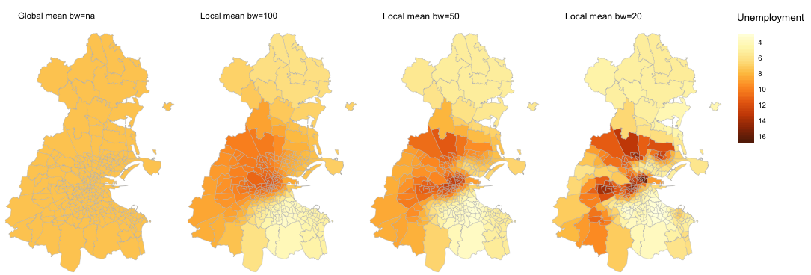
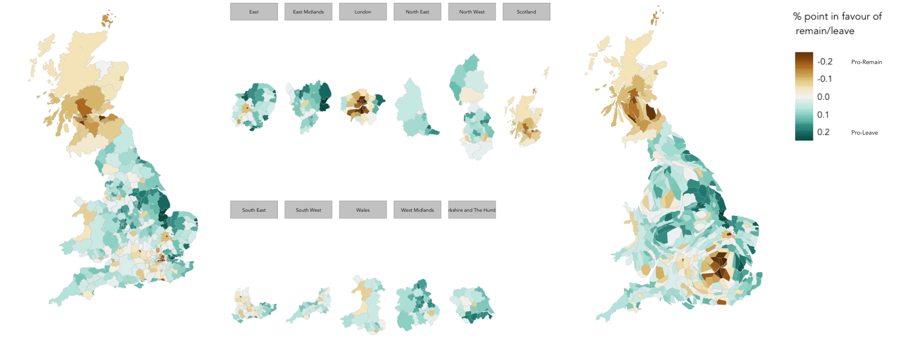

= Data Science Practicals in R
:page-title: Data Science Practicals in R
:page-description: A collection of R practical sessions for Data Science teaching
Roger Beecham <roger.beecham@city.ac.uk>

== Exploring spatial variation using Geographyically-weighted summary statistics

The fact that phenomena vary systematically from place to place makes geography an interesting unit of analysis.
This nevertheless creates a challenge for statistical analysis.
Geographers have argued that conventional _whole-map_ statistics (http://www.geog.leeds.ac.uk/papers/96-7/[Openshaw, 1991])  provide too much data reduction and likely hide important spatial variation.
Imagine, for example, that you were studying neighbourhood-level crime rates across the London region.
The average rate across all neighbourhoods might be 8 crimes per 1,000 population.
However, one would not expect this crime rate to be typical of any randomly selected neighbourhood in the capital.
Geographically Weighted-statistics (e.g. http://www.sciencedirect.com/science/article/pii/S0198971501000096)[Brunsdon, 2002])  have been proposed in response to this.
They allow us to identify changes in the process that is being studied over space.
This practical introduces and examines Geographically-Weighted summary statistics in R, using the  https://cran.r-project.org/web/packages/GWmodel/index.html[GWmodel] package.

[NOTE]
====
The full practical can be viewed from this https://github.com/rogerbeecham/data-science-practicals/blob/master/07-gwss_intro.md[page].
====

== Extended case study: spatially varying explanations behind the UK's vote to leave the EU

This practical continues with the theme of local statistics through a somewhat depressing, though very current, topic: the UK's referendum vote on membership of the EU.
The narrow vote in favour of Leave was a shock to many.
You've probably heard commentators remark on the underlying causes for why people voted as they did.
These pronouncements have often been made based on the very obvious http://www.bbc.co.uk/news/uk-politics-36616028[geographic differences] in voting preference.
A familiar caricature in the media is of Leave voting being a symptom of blue collar disaffection and Remain voting of liberal values and (relative) affluence.
But is this borne out in the data?
Here we'll take a single outcome variable -- the share of vote in favour of Leave in each GB Local Authority (LA) -- and study the extent to which key socio-economic variables from the 2011 Census might explain this outcome.
Using geographically-weighted stats we'll investigate how the relationships in candidate explanations vary geographically.
This is a reasonably involved data analysis that draws on some routine R packages and scripting conventions for structuring and charting data.

[NOTE]
====
The full practical can be viewed from this https://github.com/rogerbeecham/data-science-practicals/blob/master/08-brexit_analysis.md[page].
====

{empty} +

---

[small]#Content by http://www.roger-beecham.com[Roger Beecham].#
